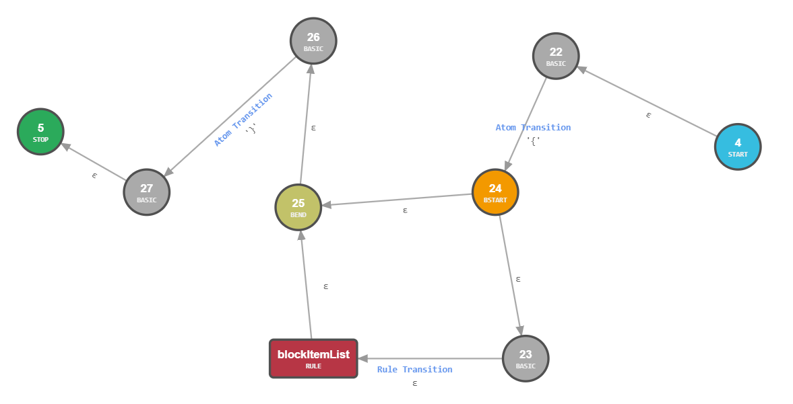
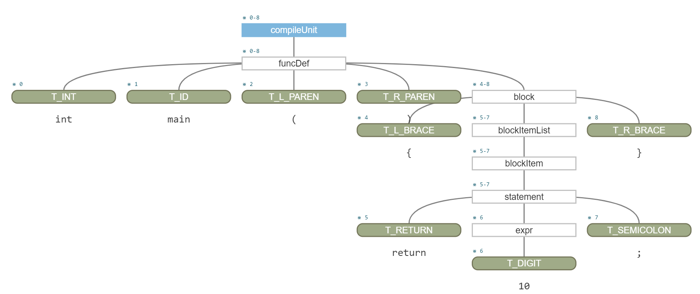

# 在VSCode中使用Antlr4

## 编写Antlr4的输入文件MiniC.g4

```antlr4
grammar MiniC;

// 词法规则名总是以大写字母开头

// 语法规则名总是以小写字母开头

// 每个非终结符尽量多包含闭包、正闭包或可选符等的EBNF范式描述

// 若非终结符由多个产生式组成，则建议在每个产生式的尾部追加# 名称来区分，详细可查看非终结符statement的描述

// 语法规则描述：EBNF范式

// 源文件编译单元定义，目前只支持一个函数定义。 如需要支持多个，请修改语法产生式
compileUnit: funcDef;

// 函数定义，目前不支持形参，也不支持返回void类型等
funcDef: T_INT T_ID T_L_PAREN T_R_PAREN block;

// 语句块看用作函数体，这里允许多个语句，并且不含任何语句
block: T_L_BRACE blockItemList? T_R_BRACE;

// 每个ItemList可包含至少一个Item
blockItemList: blockItem+;

// 每个Item可以是一个语句 TODO 变量声明也是
blockItem: statement;

//TODO 变量声明

// 目前语句支持return和赋值语句
statement: T_RETURN expr T_SEMICOLON         # returnStatement;

// 目前表达式只支持一个无符号整数
expr: T_DIGIT;

// 用正规式来进行词法规则的描述

T_L_PAREN: '(';
T_R_PAREN: ')';
T_SEMICOLON: ';';
T_L_BRACE: '{';
T_R_BRACE: '}';

// 要注意关键字同样也属于T_ID，因此必须放在T_ID的前面，否则会识别成T_ID
T_RETURN: 'return';
T_INT: 'int';

T_ID: [a-zA-Z_][a-zA-Z0-9_]*;
T_DIGIT: '0' | [1-9][0-9]*;

/* 空白符丢弃 */
WS: [ \r\n\t]+ -> skip;
```

## 铁路图(Railroad Diagram)显示

### 概要

铁路图（Railroad Diagram)，又叫语法图(Syntax Diagram)，是一种表示形式语法的方式，是巴科斯范式和扩展巴科斯范式的图形化表示。

铁路图的基本规则：
- 从左边界开始，沿着轨道到右边界。
- 沿途，你会在圆框中遇到的是非终结符，在方块中遇到的是终结符。
- 任何沿着轨道能走通的序列都是合法的。任何不能沿着轨道走通的序列都是非法的。
- 末端只有一个竖条的铁路图，表示允许在任意一对符号中插入空白，而在末端有两个竖条的铁路图则不允许。

### 举例

右键单击MiniC.g4中的block: T_L_BRACE blockItemList? T_R_BRACE，选择Show Railroad Diagram for Rule可显示如下图。


## 扩充转移网格(ATN: Augmented Transition Network)显示

### 概要

扩充转移网络是自然语言自动处理的一种方法，简称ATN。许多自然语言信息处理的专用软件都是根据扩充转移网络可以解释语义、分析句子结构的原理设计的。

ATN在1970年美国人工智能专家W.A.伍兹提出。它采用状态图来控制自然语言的分析过程。每幅状态图相当于一个网络，由状态和边构成，在状态图的各条边上，可以注明所分析的词，或词组类型符号。每一个词组类型符号又可以作为一个子网络的开头，因而当采用扩充转移网络来分析自然语言的句子时，如果分析到某一词组类型符号，就可以转移到相应的子网络，如果处理结束或处理失败，可再回到原来的网络继续进行分析，直到分析完整个句子为止。

### 举例

右键单击MiniC.g4中的block: T_L_BRACE blockItemList? T_R_BRACE，选择*Show ATN Graph for Rule*可显示如下图。



## 具体语法树(Concrete Syntax Tree)显示

在.vscode下的launch.json增加如下的配置：
```json
{
	"type": "antlr-debug",
	"request": "launch",
	// 调试的名称，可修改
	"name": "Debug minic Antlr4 Grammar",
	// 文法解析的输入文件
	"input": "tests/test1-1.c",
	// 分析树可视化，也就是具体语法树AST
	"visualParseTree": true,
	// 文本输出分析树
	"printParseTree": true,
	// 语法的开始符号
	"startRule": "compileUnit",
	// 描述语法的g4文件
	"grammar": "${workspaceFolder}/frontend/antlr4/MiniC.g4"
},
```
然后在Run and Debug中选择Debug Calculator Antlr4 Grammar进行调试即可输出具体语法树。如下图所示。


